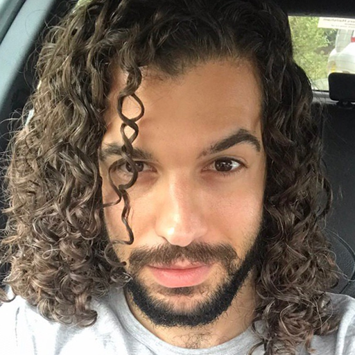
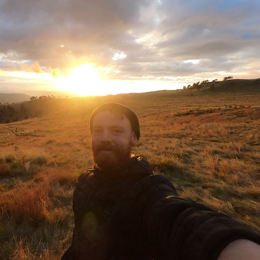

# twitter_clone

Twitter clone created during DevelopMe\_ bootcamp to learn team workflows (assisted by Git and Gulp).

## Live site

https://zackads.github.io/twitter_clone/

## The team

<strong>Team 1</strong> is made up of Dean, Oscar and Zack. Dean is passionate about origami, Zack is fanatical about CSS grid and Oscar is ready for a beer.

## Setup instructions (Zack)

- How to get started with the project

## Gulp tasks (Dean)

- sass -> CSS
- minify CSS
- JS minify (uglify)
- JS concatenate
- Live reload

## New to the team? (Zack)

- How we track issues
- Link to project kanban
- Link to Wiki
